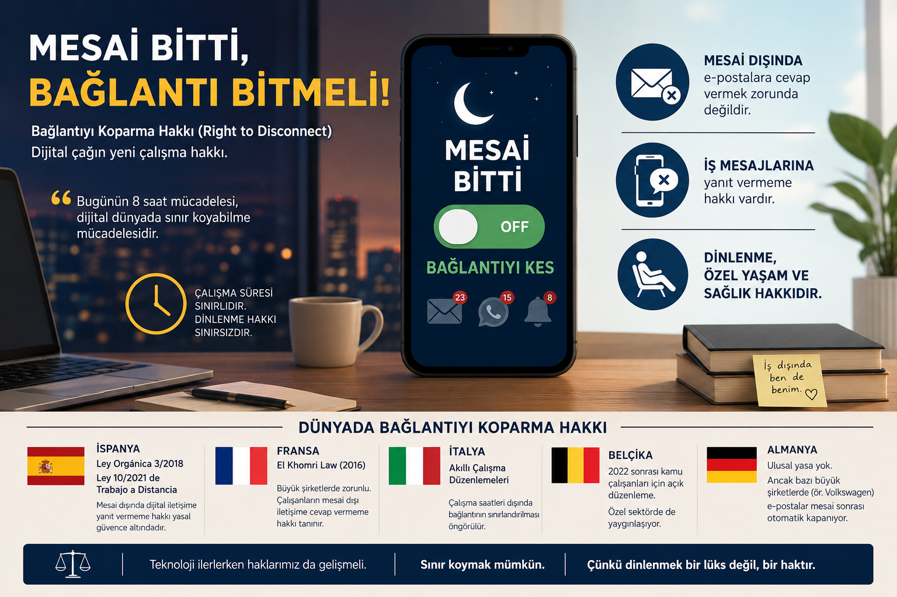

{fig-align="center" width="100%"}

Mayıs 2026'nın ortasında Türk iş hukuku için önemli bir eşik aşıldı.

İstanbul Bölge Adliye Mahkemesi, mesai saatleri dışında işveren tarafından WhatsApp üzerinden iletilen iş talimatlarının belirli koşullar altında fazla çalışma kapsamında değerlendirilebileceğine hükmetti ve işçiye fazla mesai ücreti ödenmesine karar verdi. Kararın tam metni henüz kamuoyuyla paylaşılmamış olsa da medyaya yansıyan hukuki değerlendirmelere göre mahkeme üç temel kriteri esas aldı: mesajın doğrudan iş emri niteliği taşıması, çalışan üzerinde sürekli erişilebilir kalma baskısı oluşturulması ve mesai saatleri dışında sisteme giriş yapılarak fiilen görev icra edilmesi.

Bu karar tek başına durmuyor. Yargıtay 9. Hukuk Dairesi'nin son dönem kararları da dijital kayıtların, iş yerindeki fiili çalışma düzeninin ve işverenin somut talimatlarının fazla mesai davalarında birincil ispat araçları olduğunu tutarlı biçimde vurguluyor. İstanbul BAM'ın bu kararı, o yönelimi daha somut bir zemine taşıyor.

## Hangi Dijital Kayıtlar Delil Sayılabilir?

İş hukuku uzmanlarına göre fazla mesai davalarında kullanılabilecek dijital kanıtlar artık oldukça geniş bir yelpazeye yayılıyor:

- WhatsApp yazışmaları ve grup mesajları
- Microsoft Teams, Slack veya benzer platformlardaki görev kayıtları
- Zoom, Meet gibi uygulamaların toplantı logları
- Kurumsal e-posta trafikleri ve gönderim saatleri
- Şirket sistemlerine ait giriş-çıkış logları

4857 sayılı İş Kanunu'na göre haftalık 45 saatin üzerindeki çalışmalar fazla mesai kapsamına giriyor. Mesai sonrasında gönderilen ve yanıt gerektiren iş emirlerinin bu hesaplamaya dahil edilip edilemeyeceği, artık mahkemeler tarafından somut olarak ele alınan bir soru.

## Bu Tartışma Neden Şimdi Güncelleşti?

Pandemi dönemiyle birlikte uzaktan çalışma modeli kalıcı hale geldi. Bununla birlikte "işin nerede bittiği" sorusu da belirsizleşti. Akşam sekizde gelen bir WhatsApp mesajı bir görev talimatı mı, yoksa iş arkadaşlığının sıradan bir parçası mı? Yanıt vermek beklenti mi, yoksa çalışanın isteğine bırakılmış bir tercih mi?

Bu soruların cevabı, çalışanın hukuki konumunu doğrudan etkiliyor. İşveren tarafından düzenli görev verilmesi, sürekli dönüş beklenmesi ve gece çalışma talimatı gönderilmesi, fazla çalışma iddiasını güçlendiren unsurlar arasında artık açıkça sayılıyor.

Türkiye'de bu tartışma yargı kararları üzerinden ilerlemeye başlarken, konunun daha geniş bir çerçevesi var: Right to Disconnect, yani bağlantıyı koparma hakkı.

## Bağlantıyı Koparma Hakkı Nedir?

En kısa tanımıyla bu hak, çalışanın mesai saatleri dışında işle ilgili dijital iletişim kanallarına erişmek, e-postaları kontrol etmek veya mesajlara yanıt vermek zorunda olmaması anlamına geliyor. Başka bir ifadeyle:

- Mesai sonrasında e-postalara cevap vermeme,
- WhatsApp, Teams veya benzeri uygulamalardan gelen iş mesajlarını yanıtsız bırakabilme,
- İş dışında dinlenme süresini koruyabilme hakkı.

Bu yaklaşımın arkasında şu soru yatıyor: Dijitalleşme çalışma süresi ile özel yaşam arasındaki sınırı fiilen ortadan kaldırdıysa, bu sınırı hukuken yeniden nasıl çizeceğiz?

Bir benzetme yapmak gerekirse: 19. yüzyılın mücadelesi günlük çalışma süresini sekiz saate indirmekti. 21. yüzyılın mücadelesi ise dijital dünyada çalışma ile dinlenme arasındaki sınırı yeniden kurmak olabilir.

## Avrupa'da Bu Mesele Nasıl Çözüldü?

Türkiye'de bu tartışma henüz yargı içtihadı düzeyinde seyrederken, birçok Avrupa ülkesi konuyu doğrudan yasal güvenceye bağladı.

İspanya, bağlantıyı koparma hakkını üç ayrı yasal düzenlemeyle çerçeveledi: Estatuto de los Trabajadores'ın 20bis maddesi, Ley Orgánica 3/2018'in (LOPDGDD) 88. maddesi ve Ley 10/2021 de trabajo a distancia'nın 18. maddesi. Yasal çalışma süresi ya da toplu sözleşmeyle belirlenen süreler dışında çalışanların dijital bağlantıyı kesme hakkı güvence altında; işverenler bu hakkın nasıl kullanılacağını tanımlayan bir iç politika belirlemekle yükümlü. Bununla birlikte, 2024 tarihli InfoJobs araştırmasına göre İspanyol çalışanların yaklaşık yüzde 79'u mesai dışında iş e-postalarını kontrol etmeye devam ediyor. Yazılı hukuk ile çalışma kültürü arasındaki mesafe, düzenlemenin en tartışmalı boyutu olmayı sürdürüyor.

Fransa, 2016 yılında kabul edilen ve 1 Ocak 2017'de yürürlüğe giren El Khomri Kanunu (Loi Travail, Kanun No. 2016-1088) ile bu hakkı işçi mevzuatına taşıyan ilk ülkelerden biri oldu. Elli ve üzeri çalışanı olan işletmelerde konu işçi temsilcileriyle müzakere edilerek belirleniyor; ancak kanun hakkı tanımlamıyor, somut çerçeveyi şirketlere bırakıyor. Yaptırım mekanizmalarının zayıflığı eleştirilere konu olsa da 2018'de Fransa Yüksek Mahkemesi'nin bir işvereni çalışanını mesai dışında sürekli erişilebilir kılmaktan ötürü 60.000 Euro tazminata mahkum etmesi, yasanın pratikte sonuç üretebileceğini gösterdi.

İtalya, smart working çerçevesinde çalışma saatleri dışında dijital erişimin sınırlandırılmasına yönelik düzenlemeler geliştirdi. Belçika, 2022 sonrasında önce kamu çalışanları için daha kapsamlı koruma mekanizmaları oluşturdu; uygulama zamanla özel sektöre de yayılmaya başladı.

Almanya'da ulusal düzeyde bu konuya özgü bir yasa yok. Buna karşın Volkswagen, 2012'de toplu sözleşme kapsamındaki çalışanlar için mesai bitiminden 30 dakika sonra e-posta iletimini otomatik olarak durduran bir düzenlemeyi hayata geçirdi. Yasa olmadan da kurumsal iradenin bu meseleyi şekillendirebileceğini gösteren bir örnek.

Bu tablonun ortaya koyduğu bir gerçek var: Dönüşümü her zaman yasa tek başına şekillendirmiyor. Kimi zaman kurum kültürü yasanın önüne geçiyor, kimi zaman ise yargı kararları yasaları zorunlu kılıyor.

## Türkiye'de Bundan Sonra Ne Olur?

Türkiye'de bağlantıyı koparma hakkını doğrudan düzenleyen bir yasal çerçeve henüz yok. Ancak İstanbul BAM kararı, bu boşluğun yargı içtihadı yoluyla doldurulmaya başlandığını gösteriyor.

Mesai sonrası dijital iş talimatları artık "gayri resmi bir istek" olarak değil, çalışma süresi tartışmasına konu olabilecek hukuki bir olgu olarak ele alınıyor. Bu durum hem çalışanlar hem işverenler hem de İK departmanları için somut sonuçlar doğuruyor.

Dijitalleşmeyle birlikte "ofisten çıkmak" ile "işten çıkmak" birbirinden giderek ayrışıyor. Bu ayrışmanın hukuki karşılığını ne zaman ve nasıl kuracağımız ise önümüzdeki yıllarda hem yargı hem de yasamanın gündeminde kalmaya devam edecek.

## Kaynaklar

- İstanbul Bölge Adliye Mahkemesi kararına ilişkin haber ve değerlendirmeler, Mayıs 2026:
- Cumhuriyet: https://www.cumhuriyet.com.tr/turkiye/milyonlarca-isciyi-ilgilendiriyor-mahkemeden-kritik-whatsapp-karari-2505113
- Memur Postası: https://www.memurpostasi.com/haber/28015202/mahkemeden-emsal-karar-mesai-disi-mesajlar-fazla-mesai-sayilabilir
- Personel Sağlık: https://www.saglikpersoneli.com.tr/mesai-disi-whatsapp-mesajlari-fazla-calisma-sayildi
- 4857 Sayılı İş Kanunu, Madde 41 (Fazla Çalışma). Resmi Gazete, Sayı 25134, 10 Haziran 2003.
- Ley Orgánica 3/2018, de 5 de diciembre, de Protección de Datos Personales y Garantía de los Derechos Digitales, Artículo 88. Boletín Oficial del Estado, num. 294, 6 de diciembre de 2018. https://www.boe.es/eli/es/lo/2018/12/05/3
- Ley 10/2021, de 9 de julio, de trabajo a distancia, Artículo 18. Boletín Oficial del Estado, num. 164, 10 de julio de 2021. https://www.boe.es/eli/es/l/2021/07/09/10
- Real Decreto Legislativo 2/2015, de 23 de octubre, por el que se aprueba el texto refundido de la Ley del Estatuto de los Trabajadores, Artículo 20 bis. Boletín Oficial del Estado, num. 255, 24 de octubre de 2015. https://www.boe.es/eli/es/rdlg/2015/10/23/2
- Loi n° 2016-1088 du 8 aout 2016 relative au travail, a la modernisation du dialogue social et a la securisation des parcours professionnels. Journal Officiel de la République Française, 9 aout 2016. https://www.legifrance.gouv.fr/jorf/id/JORFTEXT000032983213
- InfoJobs. (2024). Informe sobre Desconexión Digital. https://www.infojobs.net
- NPR / The Two-Way. (2011, Aralık 23). Work, life balance: VW agrees to switch off after-hours email. https://www.npr.org/sections/thetwo-way/2011/12/23/144200222/work-life-balance-vw-agrees-to-switch-off-after-hours-email

  <a class="share-btn x"
     href=""
     id="share-x"
     target="_blank" rel="noopener noreferrer">X'te Paylaş</a>

  <a class="share-btn linkedin"
     href=""
     id="share-linkedin"
     target="_blank" rel="noopener noreferrer">LinkedIn'de Paylaş</a>

  <a class="share-btn instagram"
     href="#"
     onclick="copyInstagramLink(); return false;">Instagram için Linki Kopyala</a>

